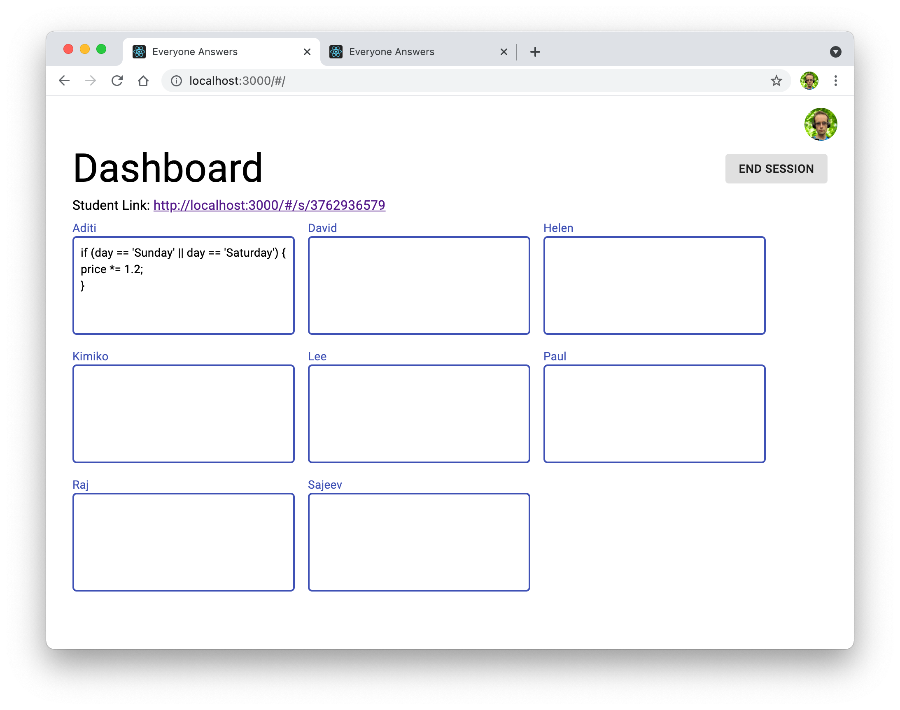

# Capstone Project - Everyone Answers

Additional Features

In this project you will create a web app which allows a teacher to log in and view student answers in real-time using the following technologies
* React JS
* Material-UI for React
* Firebase Authentication
* Firebase Firestore Database

## Part 1: Log In and Show Setup Page

*Estimated time: 3hrs*

When the teacher goes to the site for the first time, they see a login page which looks like this:

After logging in with their Google credentials the teacher sees the page where they can enter a list of students.

Note:
* The teacher should stay logged in after pressing the Refresh button
* Clicking on the profile picture in the top-right corner should log out and return to the login screen
* The Submit button does not need to be implemented for Part 1

## Part 2: Save Setup and Show Dashboard Page

*Estimated time: 3hrs*

When teacher clicks 'Submit', set the status message to 'Submitting...' while storing list in Firestore database

Notes: 
* If teacher tries to submit empty list or list with duplicate names, show a simple browser alert describing the error
* If attempt to store data in firebase fails, show the error description in the status message. (ie. change it from 'Submitting' to 'Error: ...')

If list is saved successfully, show the dashboard page:

Note: 
* The boxes should be sorted by student name
* The student link can be hardcoded for Part 2
* The list of student names should not be public information.  That is, Firestore rules should ensure that the list of names for one teacher is not visible to another teacher

## Part 3: Load Dashboard at Login

*Estimated time: 1hr*

If teacher logs out of dashboard and logs in again, show a loading indicator while retrieving the dashboard information:

If loading fails, show an error message like this:

If there is no error:
1. Show the Setup page if the user hasn't previously submitted it
2. Otherwise show the Dashboard page using the names loaded from the database

## Part 4: End Session

*Estimated time: 30mins*

Add an 'End Session' button to the Dashboard page as shown below.  

Note: Clicking the 'End Session' button should prompt the user to confirm that they want to end the session (use a basic browser confirmation box).  If the user confirms, then:
1. Show a status message to the left of the button 
2. Delete the student names in the Firestore database, and any other data that was created in Step 2
3. If successful, show the Setup page again.  Otherwise show the error description in the status message of the Dashboard page.

## Part 5: Student Name and Answer Pages

*Estimated time: 1hr*

On the Dashboard page there is a student link.   Change the way the link is generated and ensure that when the teacher shares this link with a student, the student  sees a page where they can select their name:

Note: While fetching the list of student names from Firestore, display the same 'Loading...' page as in Step 3.

When the student selects their name and clicks 'Continue', show the following page:

## Part 6: Show Student Answer on Dashboard

*Estimated time: 40mins*

When the user makes a change to the text field, set the status message to 'Syncing...' and save the answer in Firestore.  If the save is successful, set the status message to 'Sync complete' as shown here:

The Dashboard should listen for changes to the database and automatically update the associated answer fields:

## Part 7: Clear Answers

*Estimated time: 1hr*

Add a 'Clear Answers' button which clears all answers (ie. set all answers to be an empty string).

Note:
* Set the status message to 'Clearing answers...' while processing the action
* Student answer pages should listen for this event and clear the answer text field on their page

